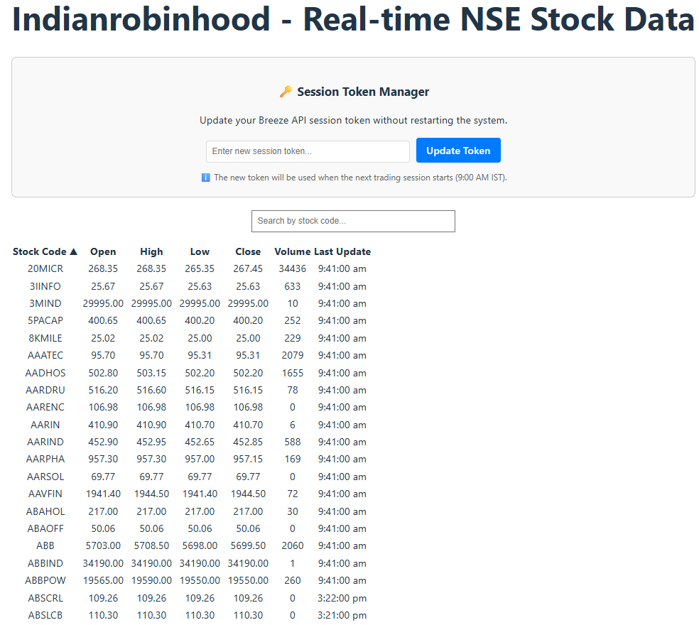
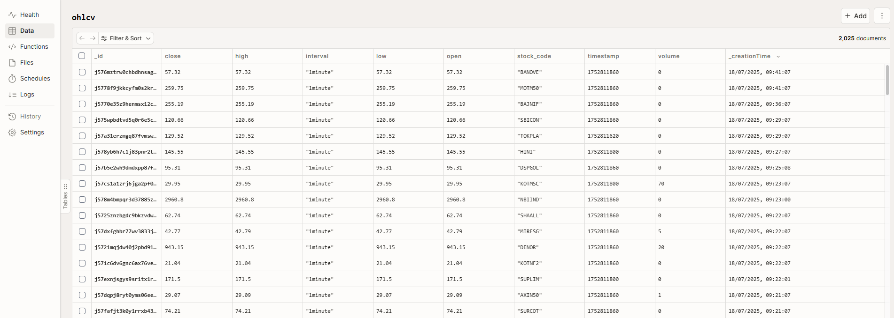
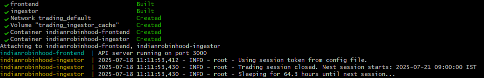

# 🚀 Indianrobinhood - Real-Time NSE Stocks Data Platform

[](https://opensource.org/licenses/MIT)
[](https://www.docker.com/)

A comprehensive opensource real-time stocks data platform designed specifically for Indian markets, featuring live NSE stock data ingestion and modern web interface.



## 🌟 Features

### 📊 Real-Time Market Data
- **Live NSE Stock Data**: Real-time OHLCV data for ~2400 NSE stocks
- **Time intervals**: High-frequency OHLCV data (1second, 1minute, 5minute, 30minute)
- **Market Hours Automation**: Automatic start/stop based on Indian market hours (9:15 AM - 3:30 PM IST)
- **Holiday Management**: Configurable market holidays support

### 🔧 Modern Technology Stack
- **Frontend**: ReactJS with real-time updates and live price animations
- **Backend**: Convex database with real-time synchronization  
- **Data Source**: ICICI Breeze API integration with WebSocket connection
- **Deployment**: Docker containers

### 🛡️ Production-Ready Features
- **Hot-Reload Token Management**: Web-based session token updates without container restarts
- **Error Handling**: Graceful reconnection and duplicate filtering
- **Monitoring**: Comprehensive logging and health checks
- **Scalability**: Container orchestration ready for production deployment

## 🚀 Quick Start

### Prerequisites
- **System**: Docker & Docker Compose, Node.js 20+
- **Accounts**: Active ICICI Direct account with Breeze API access
- **Resources**: 4GB RAM, 2 CPU cores minimum

### 1. Clone Repository
```bash
git clone https://github.com/indianrobinhood/trading.git
cd trading
```

### 2. Environment Setup
```bash
# Create environment file
touch .env

# Configure your credentials (see INSTALLATION.md for detailed values)
nano .env
```

### 3. Convex Backend Setup
```bash
# Install Convex
npm install convex

# Login and setup
npx convex login
npx convex dev  # for development
# OR
npx convex deploy  # for production
```

### 4. Start Services
```bash
# Development
docker-compose up

# Production
docker-compose -f docker-compose.prod.yml up -d
```

### 5. Access Application
- **Frontend**: http://localhost:8002 (production) or http://localhost:5173 (development)
- **Real-time Data**: View live stock prices with search and sort
- **Token Manager**: Update Breeze session tokens via web interface

### 🔍 Key Directories Explained

**`src/`** - React frontend with real-time stock data display
- Real-time price updates with color-coded animations
- Search and sort functionality for stock data
- Web-based token management interface

**`convex/`** - Serverless backend with real-time database
- OHLCV data storage with duplicate prevention
- Real-time synchronization to frontend
- HTTP endpoints for Python data ingestion

**`docs/`** - Comprehensive documentation
- Installation guides for development and production
- Configuration reference for all environment variables
- Technical documentation for token management system

**Root Files** - Core services and configuration
- `breeze_ingestor.py`: Connects to Breeze API and ingests stock data
- `api-server.cjs`: Handles token updates via web interface
- Docker configuration for containerized deployment

## 📸 Screenshots

Here's a look at the different components of the platform in action.

**Convex OHLCV Table:**
*After running `npx convex dev`, you can view your project's backend, including database tables, schema, and function logs in your browser.*


---

**Successful Service Verification:**
*After running `docker-compose -f docker-compose.prod.yml up --build`, this is the expected output showing that all services are running correctly.*
