# 🔑 Token Management System

This document explains the innovative web-based token management system that allows hot-reloading of Breeze API session tokens without container restarts.

## 🎯 Overview

The token management system solves a critical problem: **Breeze API session tokens expire daily**, but restarting containers during trading hours disrupts data collection. Our solution enables seamless token updates via a web interface.

## 🏗️ System Architecture


## 🔧 Technical Implementation

### 1. React TokenManager Component

**Location**: `src/components/TokenManager.tsx`

```typescript
export function TokenManager() {
  const [token, setToken] = useState("");
  const [isUpdating, setIsUpdating] = useState(false);
  const [message, setMessage] = useState("");
  
  const updateToken = async () => {
    // Validate token input
    if (!token.trim()) {
      setMessage("Please enter a valid token");
      return;
    }
    
    // Call Express API
    const response = await fetch('/api/update-token', {
      method: 'POST',
      headers: { 'Content-Type': 'application/json' },
      body: JSON.stringify({ token: token.trim() })
    });
    
    if (response.ok) {
      setMessage("Token updated successfully! Will take effect on next trading session.");
      setToken(""); // Clear input for security
    }
  };
}
```

**Features**:
- Password input field for security
- Real-time validation
- Success/error feedback
- Input clearing after successful update

### 2. Express API Server

**Location**: `api-server.cjs`

```javascript
app.post('/api/update-token', (req, res) => {
  try {
    const { token } = req.body;

    // Validate token format - CORRECTED: minimum 6 characters (not 10)
    if (!token || typeof token !== 'string' || token.length < 6) {
      return res.status(400).json({ 
        success: false, 
        message: 'Invalid token format - token must be at least 6 characters' 
      });
    }

    // File path in the shared volume
    const tokenFilePath = '/app/config/session_token.txt';
    const configDir = path.dirname(tokenFilePath);

    // Ensure directory exists
    if (!fs.existsSync(configDir)) {
      fs.mkdirSync(configDir, { recursive: true });
    }

    // Write token to file
    fs.writeFileSync(tokenFilePath, token.trim());

    console.log(`[${new Date().toISOString()}] Token successfully written to ${tokenFilePath}`);

    res.json({ 
      success: true, 
      message: 'Token updated successfully! Will take effect on next trading session.' 
    });

  } catch (error) {
    console.error('Error updating token:', error);
    res.status(500).json({ 
      success: false, 
      message: 'Internal server error' 
    });
  }
});
```

**Key Features**:
- Input validation (minimum 6 characters, not 10)
- Directory creation if needed
- Atomic file writing
- Comprehensive error handling
- Detailed debugging logs
- Security logging

### 3. Python Token Reader

**Location**: `breeze_ingestor.py`

```python
def get_session_token():
    """
    Get session token with priority order:
    1. File-based token (from web portal)
    2. Environment variable (fallback)
    """
    try:
        # Check shared volume file first
        if os.path.exists(TOKEN_FILE_PATH):
            with open(TOKEN_FILE_PATH, 'r') as f:
                token = f.read().strip()
                if token:
                    logging.info("Using session token from config file.")
                    return token
    except Exception as e:
        logging.warning(f"Could not read token from file: {e}")
    
    # Fallback to environment variable
    env_token = os.getenv("BREEZE_SESSION_TOKEN")
    if env_token:
        logging.info("Using session token from environment variable.")
        return env_token
    
    return None
```

**Features**:
- Priority-based token selection
- Graceful fallback mechanism
- Clear logging of token source
- Error handling for file operations

## 🔄 Token Update Workflow

### User Experience Flow

```mermaid
sequenceDiagram
    participant User as 👤 User
    participant Browser as 🌐 Browser
    participant React as ⚛️ React App
    participant Express as 🚀 Express API
    participant Volume as 💾 Shared Volume
    participant Python as 🐍 Python Ingestor
    participant Breeze as 📊 Breeze API
    
    User->>Browser: Visit http://server:8002
    Browser->>React: Load TokenManager component
    React->>User: Display token input form
    
    User->>React: Enter new session token
    User->>React: Click "Update Token"
    
    React->>Express: POST /api/update-token
    Express->>Express: Validate token format
    Express->>Volume: Write to /app/config/session_token.txt
    Express->>React: Return success response
    React->>User: Show "Token updated successfully!"
    
    Note over Python: Next trading session (9:00 AM IST)
    Python->>Volume: Read session_token.txt
    Python->>Python: Use new token
    Python->>Breeze: Connect with new token
    Breeze->>Python: Authentication success
```



### Technical Data Flow

1. **Web Input**: User enters token in React component
2. **API Call**: React sends POST request to `/api/update-token`
3. **Validation**: Express validates token format and length
4. **File Write**: Express writes token to shared volume
5. **Response**: Success message returned to user
6. **Hot Reload**: Python ingestor reads new token at next session start
7. **Authentication**: New token used for Breeze API connection
